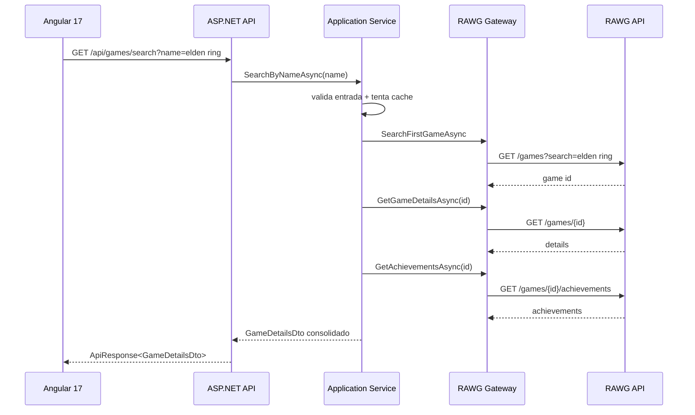

# Architecture

## Clean Architecture aplicada

A solucao separa regras de negocio da infraestrutura externa para manter baixo acoplamento e evolucao segura.

### Camadas e responsabilidades

- Domain
  - entidades centrais do negocio
  - sem dependencia de framework

- Application
  - caso de uso SearchByNameAsync
  - contratos (IRawgGateway, IGameSearchCache, IGameSearchService)
  - DTOs da aplicacao

- Infrastructure
  - cliente HTTP RAWG (sem SDK)
  - cache em memoria
  - binding de configuracao

- Api
  - endpoint HTTP
  - middleware global de excecao
  - serializacao de resposta

## Fluxo da requisicao

## DDD aplicado

- Entidades de dominio: Game e Achievement
- Contratos de aplicacao para isolamento de infraestrutura
- Linguagem ubiqua orientada ao dominio de catalogo de jogos

## Repository e Service pattern

- Service pattern: GameSearchService orquestra o caso de uso
- Gateway pattern (equivalente a repository externo): RawgGateway encapsula acesso HTTP

## DTOs

- GameDetailsDto e AchievementDto na camada Application
- evita vazar modelos de infraestrutura para fora

## Tratamento de erros

- excecoes de aplicacao (validation, not found, external)
- middleware global converte para resposta HTTP consistente
- erros inesperados viram 500 padronizado

## Consumo HTTP

- IHttpClientFactory
- timeout configurado
- desserializacao via System.Net.Http.Json
- sem SDK da RAWG

## Configuracao e DI

- RawgOptions via Options Pattern
- AddApplication e AddInfrastructure para composicao limpa
- DI centralizada no Program

## Estrategia Angular

- feature-first para tela de busca
- interceptors para concerns transversais
- estado local com signals + RxJS
- componentes compartilhados para skeleton e fallback

## Motivos das decisoes

- escalabilidade: cada camada evolui com menor impacto
- manutencao: responsabilidades explicitas
- testabilidade: contratos facilitam mocks e testes
- legibilidade: fluxo direto e previsivel
